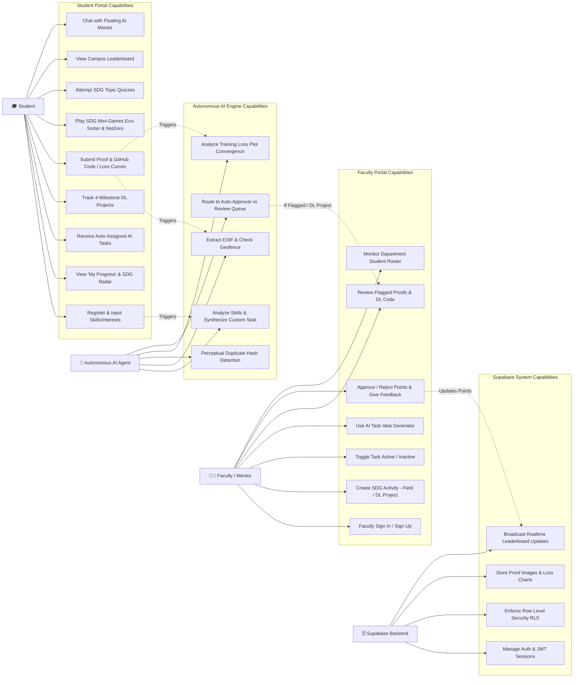
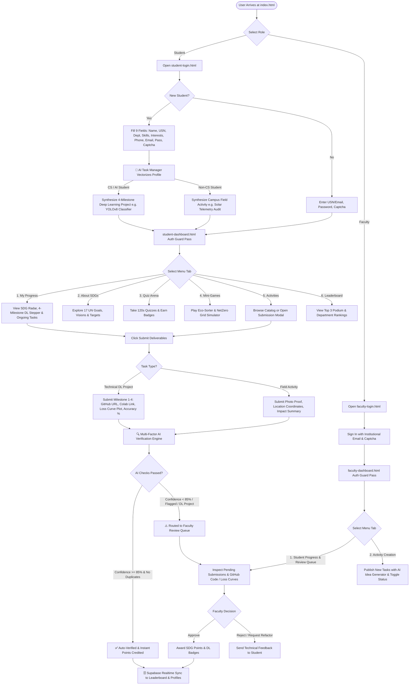

# Architectural Diagrams — AI-Powered SDG Campus Platform

This document contains the **Use Case Diagram**, **System Process Flow Diagram**, and **Sequence Diagram** for the platform.

---

## 1. 📌 Use Case Diagram



---

## 2. 🔄 System Process Flow Diagram



---

## 3. ⏱️ Sequence Diagram (End-to-End Execution)

```mermaid
sequenceDiagram
    autonumber
    actor Student as 🎓 Student
    participant UI as 🖥️ Web Portal (HTML/JS)
    participant Auth as 🔐 Auth Guard & Sessions
    participant AIAgent as 🤖 Autonomous AI Task Assigner
    participant AIVerify as 🔍 Multi-Factor AI Verifier
    participant Supabase as 🗄️ Supabase (DB + Storage)
    actor Faculty as 👨‍🏫 Faculty Reviewer

    %% 1. Registration & AI Assignment
    Student->>UI: Fills Sign Up (Skills: Python, PyTorch; Interests: SDG 12)
    UI->>Supabase: Inserts New Student Profile into `profiles`
    Supabase-->>AIAgent: Profile Webhook / Hook Triggered
    Note over AIAgent: Analyzes CS Profile + SDG 12<br/>Synthesizes 4-Milestone YOLOv8 Task
    AIAgent->>Supabase: Inserts `TASK-DL-201` into `student_assigned_tasks` (Milestone 1, 25%)
    Supabase-->>UI: Real-time Sync: Ongoing Task Active
    UI-->>Student: Renders 'My Progress' with 4-Milestone Stepper

    %% 2. Milestone Deliverable Submission
    Student->>UI: Submits Milestone 3 (GitHub URL, Loss Curve Plot, 93.4% mAP)
    UI->>Supabase: Uploads Loss Chart to Storage (`sdg-proofs/`)
    UI->>AIVerify: Dispatches Submission Payload for AI Verification
    Note over AIVerify: 1. Checks GitHub Repo Integrity<br/>2. Confirms Loss Curve Convergence<br/>3. Verifies mAP Metric > 90%
    AIVerify->>Supabase: Inserts Submission with Confidence: 94% (Status: 'Needs Review')

    %% 3. Faculty Human-in-the-Loop Review
    Faculty->>UI: Opens `faculty-dashboard.html` [Review Queue]
    UI->>Supabase: Queries Pending Submissions from `submissions`
    Supabase-->>UI: Returns Milestone 3 Deliverables & GitHub Link
    Faculty->>UI: Clicks "Inspect GitHub Code" & Views Loss Plot
    Faculty->>UI: Clicks "Approve (+300 pts)" with Feedback
    UI->>Supabase: Updates `verification_status` = 'Verified', Credits +300 pts to `profiles`
    
    %% 4. Real-time Notification & Leaderboard Update
    Supabase-->>UI: Realtime Broadcast (Points Updated)
    UI-->>Student: Proactive Notification: "Milestone Approved! +300 pts Credited"
    UI-->>Student: Unlocks "Deep Learning Changemaker" Badge on Leaderboard
```
